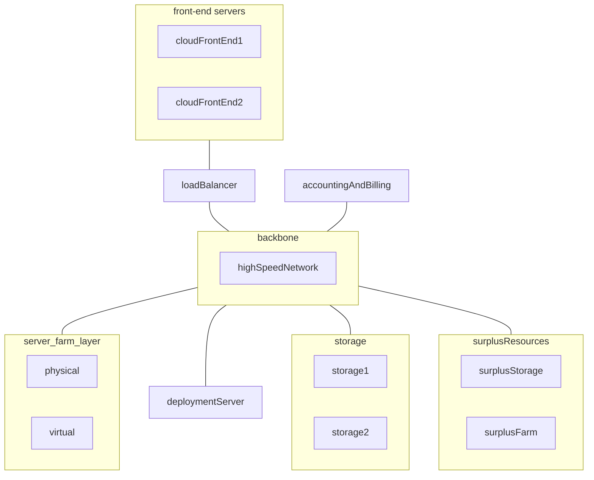
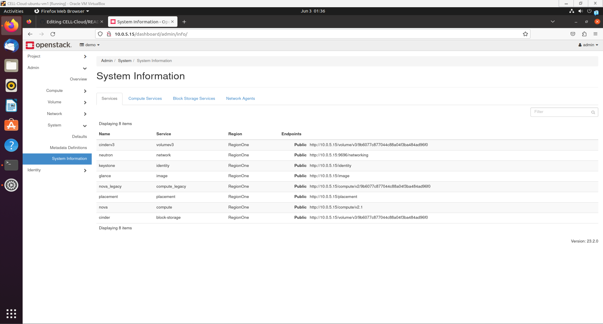

# CELL : Cloud Computing

uuid: ka7462

## Overview

This course is a walkthrough for the purposes of learning the fundamentals of configuring & designing cloud computing solutions.

This course is split up into 4 iterations:

| Iteration |  Title   |
| --------- | -------- |
|     0     | [setting up](https://github.com/kyadamos/CELL-Cloud/blob/main/README.md#iteration-0-setting-up)    |
|     1     | [building on basics](https://github.com/kyadamos/CELL-Cloud/blob/main/README.md#iteration-1-building-on-basics)   |
|     2     | [getting started](https://github.com/kyadamos/CELL-Cloud/blob/main/README.md#iteration-2-getting-started) |
|     3     | [going further](https://github.com/kyadamos/CELL-Cloud/blob/main/README.md#iteration-3-going-further)  |

## iteration 0: setting up

This section defines cloud computing through:

- its function
- its technological composition

### function

Cloud computing is the availability of computing resources without requiring the user to directly manage these resources. It achieves this by sharing resources across a distributed network of data centers, championing characteristics such as high and highly dynamic scalability, robust functionality & performance, and simple rand rapid deployment and operations. Some commonly sought-out cloud services include computing services, storage services, or networking services.

Many cloud providers follow a _utility-based computing model_, i.e. customers only pay for the portion of the cloud services that they use. This makes cloud computing attractive to small- and medium-sized businesses because they no longer need to develop, hire, and maintain a fully staffed team to manage their data. The utility-based computing model not only reduces the capital investment required of these smaller businesses in order to operate, but this model also allows all customers in general to scale up or down their costs/performance capabilities (computing, storage, etc.) as needed.

### composition

Clouds are essentially composed of high-performance data centers

## iteration 1: building on basics

### system information

Windows 11
VirtualBox 7.0
VirtualBox network manager configuration:

### vm information

OS Ubuntu 20.04 LTS (Focal Fossa)

#### details

#### network adapters

#### interface config & iptables

### openstack information

#### /dashboard/admin/info

#### /dashboard/admin/networks

## iteration 2: getting started
Horizon (Dashboard): Web-based user interface for OpenStack Dashboard

Nova (Compute): Project name for OpenStack Compute -- cloud computing fabric controller
 
Swift (Object Store): Highly available, distributed, consistent object/blob storage for storing large amounts of data efficiently, safely, inexpensively

Glance (Image Registry): Provides services for discovering, registering, retrieving virtual machine images. Has RESTful API to allow querying VM images & their metadata

Neutron (Networking): OpenStack project to provide Network Connectivity as a Service b/w interface devices

## iteration 3: going further

## references:
- [OpenStack from Zero to Nova: An Activity-Driven Workshop](https://www.youtube.com/watch?v=a86pfDm1Dqk): Tutorial/walkthrough of performing administrative tasks in OpenStack
